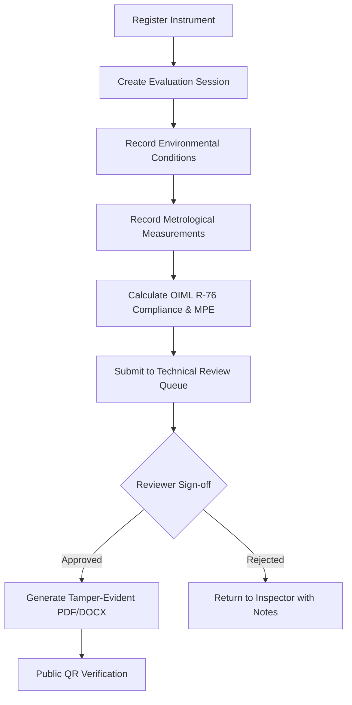
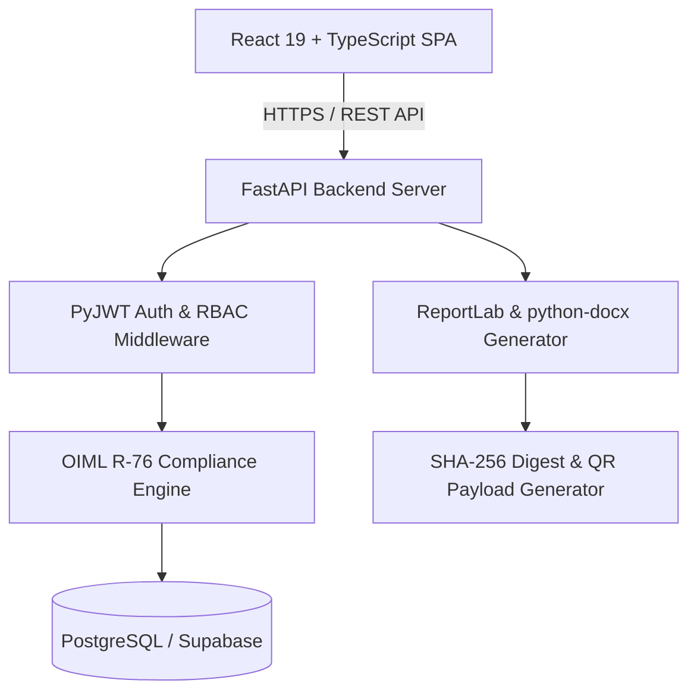

# NAWI Test Reporting System

An enterprise-grade, digital test-report generation, evaluation, and public verification platform for **Non-Automatic Weighing Instruments (NAWI)**, built according to international **OIML R-76** legal metrology standards.

---

## 🔗 Live Production Demo

**Production Deployment**: [https://nawi-report.vercel.app](https://nawi-report.vercel.app)  
**Backend API**: `https://nawi-backend-7l75.onrender.com/api/v1`  
**Public Verification Endpoint**: `https://nawi-report.vercel.app/verify-public`

---

## 📌 1. Project Overview

### What is a NAWI?
A **Non-Automatic Weighing Instrument (NAWI)** is a measuring instrument used to determine the mass of a body by using the action of gravity on that body, requiring the intervention of an operator during the weighing process (e.g., commercial retail scales, industrial platform weighbridges, and high-precision analytical laboratory balances).

### Problem Statement
Traditional legal metrology verification relies on manual paper-based inspection sheets. This legacy process suffers from several critical vulnerabilities:
- **Human Calculation Errors**: Manual calculation of Maximum Permissible Errors ($MPE$) across varying load intervals is error-prone.
- **Tampering & Fraud**: Paper verification certificates can be forged or altered without an verifiable audit trail.
- **Lack of Transparency**: Consumers, inspectors, and regulatory authorities cannot immediately verify scale calibration certificates in the field.

### System Solution
The **NAWI Test Reporting System** digitizes the entire legal metrology lifecycle:
1. Standardizes instrument registration and environmental testing parameters.
2. Automatically calculates metrological compliance against **OIML R-76-1 (2006 E)** rules.
3. Implements multi-tier technical review, digital sign-off, and tamper-evident PDF/DOCX report generation.
4. Generates a unique **SHA-256 cryptographic digest** and **QR code** on every official report for instant public verification.

---

## 🔄 2. Core Workflow



---

## ✨ 3. Key Features

- **OIML R-76 Compliance Engine**: Automated calculation of Maximum Permissible Errors ($MPE$) for Accuracy Classes **I, II, III, and IIII** across both *Initial Verification* and *In-Service Inspection* regimes.
- **Six-Step Test Session Wizard**: Guided, step-by-step workflow covering instrument selection, environmental conditions, metrological observation tests, compliance calculation, technical sign-off, and report compilation.
- **Instrument Registry**: Complete management of weighing scale specifications including capacity ($Max$), minimum load ($Min$), verification scale interval ($e$), scale interval ($d$), indicator model, and load cell parameters.
- **Laboratory & Reference Standards Management**: Tracks accreditation identifiers, test locations, and certified standard mass reference sets.
- **Technical Review Queue**: Dedicated review workspace for technical approvers to audit raw observations, inspect calculation breakdowns, and issue official approvals or rejections with feedback notes.
- **Role-Based Access Control (RBAC)**: Enforces four distinct operational roles (*Administrator*, *Laboratory Manager*, *Inspector*, *Reviewer*) with strict route and API endpoint protection.
- **Laboratory-Scoped Access Control**: Ensures users access data scoped to their assigned laboratory context.
- **JWT Authentication & Account Governance**: Secure token-based authentication with administrative user approval, deactivation/reactivation, and password reset capability.
- **Audit Logging**: Comprehensive, append-only security audit trail recording all authentication events, session creations, review approvals, and document downloads.
- **Report Generation & Multi-Format Export**: Automated compilation of tamper-evident **PDF reports** (via ReportLab) and **DOCX exports** (via `python-docx`), alongside **JSON metadata exports**.
- **Cryptographic Report Integrity & Public QR Verification**: SHA-256 hash digest embedding and public QR verification portal (`/verify/:reportNumber`) allowing instant verification without exposing sensitive internal user data.
- **Search, Filter & Sort Capabilities**: Real-time filtering across instruments, test sessions, verified reports, and audit logs.
- **Analytics & Compliance Dashboard**: Overview metrics displaying active instrument counts, pending review items, laboratory compliance rates, and recent evaluation sessions.

> ⚠️ **Known Limitation Note**: CSV report export (`/export/csv`) is currently not implemented and returns HTTP 404. PDF, DOCX, and JSON exports are fully implemented and verified.

---

## 👥 4. User Roles & Permissions

| Role | Instrument Registry | Create Test Session | Review & Approve | User Management | Audit Logs |
|------|:------------------:|:-------------------:|:----------------:|:---------------:|:----------:|
| **Inspector** | Read / Create | Full Access | View Only | Restricted | View Only |
| **Reviewer** | Read Only | View Only | Full Access (Approve/Reject) | Restricted | Full Access |
| **Laboratory Manager** | Full Access | Full Access | Full Access | View Only | Full Access |
| **Administrator** | Full Access | Full Access | Full Access | Full Access (Create/Deactivate/Reset) | Full Access |

---

## 🏗️ 5. System Architecture



### Architecture Components
- **Frontend Layer**: Built with **React 19**, **TypeScript 6**, **Vite 8**, and styled using **Tailwind CSS v4** with custom metrology visual tokens.
- **API & Application Layer**: **FastAPI** server providing asynchronous RESTful endpoints with Pydantic validation.
- **Compliance Logic Layer**: Decoupled Python calculation engine enforcing OIML R-76-1:2006 Clause 3.5 MPE formulas ($0 \le m \le 500e \implies \pm 0.5e$, etc.).
- **Persistence Layer**: **PostgreSQL** database managed via **SQLAlchemy 2.0** ORM and **Supabase**.
- **Document Generation Engine**: Programmatic PDF compilation via **ReportLab 4.1**, Microsoft Word generation via **python-docx**, and QR generation via **qrcode**.

---

## 🔒 6. Security

- **JWT Authentication**: Short-lived JSON Web Tokens passed via HTTP `Authorization: Bearer <token>` headers.
- **Client & Server Access Control**: Protected frontend routes backed by HTTP 403 Forbidden enforcement on all administrative and restricted backend endpoints.
- **Cryptographic Digest**: Each generated PDF report contains a calculated SHA-256 checksum of its data payload to detect unauthorized document alterations.
- **Public Verification Privacy**: The public QR verification route (`/verify/:reportNumber`) validates certificate authenticity while redacting internal system user IDs, passwords, and sensitive laboratory tokens.
- **Audit Logs**: Immutable log records stored for every critical system event including logins, session submissions, status transitions, and document downloads.

---

## 🎨 7. UI / UX Design

The user interface is designed around an **Institutional Metrology Visual Identity**:
- **State Emblem of India**: Official monochrome vector representation of the *Sarnath Lion Capital of Ashoka* displaying the national motto *"सत्यमेव जयते"*.
- **Warm Ivory Palette**: Custom color theme using warm off-white and ivory tones (`#FAF7F2`, `#FAF6F0`, `#EBE5DC`) paired with deep charcoal typography (`#24211D`) and copper accent highlights (`#9C5A3C`).
- **Typography Hierarchy**:
  - **Headings**: *DM Serif Display* / Serif Header for institutional title authority.
  - **Body UI**: *Hanken Grotesk* for clean, modern interface typography.
  - **Data & Metrology Values**: *JetBrains Mono* for numerical alignment, test points, and MPE thresholds.
- **Technical Blueprint Background**: Vector background grid rendering an authentic mechanical weighing scale blueprint (`TechnicalSketchBg`).
- **Graduated Measurement Ruler**: Header scale decoration symbolizing physical measurement precision.
- **Compact Layout**: Single-row application header fixed to 76px height with responsive mobile drawer navigation.

---

## 📄 8. Report Generation

The generated OIML R-76 digital test report includes:
1. **Header & Institutional Seals**: Official Government of India title block, State Emblem of India, and OIML R-76 legal metrology mark.
2. **Laboratory & Applicant Data**: Accredited laboratory ID, location, test certificate number, and applicant/owner details.
3. **Instrument Specifications**: Serial number, manufacturer, model, capacity ($Max$), minimum load ($Min$), verification scale interval ($e$), scale interval ($d$), and Accuracy Class (I, II, III, or IIII).
4. **Environmental Conditions**: Measured temperature (°C), relative humidity (%), atmospheric pressure (hPa), and standard mass serial numbers.
5. **Metrological Test Tables**:
   - Weighing Performance Test points ($0 \to Max$) with calculated error $E$ and allowed $MPE$.
   - Eccentricity (Corner Load) Test points.
   - Tare Balancing Test verification.
   - Repeatability Test spread ($P_{\max} - P_{\min}$).
6. **Compliance Decision**: Official **PASSED / COMPLIANT** or **REJECTED** certification badge.
7. **Sign-Off & Integrity Payload**: Inspector signature, Reviewer approval timestamp, embedded SHA-256 cryptographic hash, and verification QR code.

---

## 🧪 9. Testing & QA Audit

A full system QA audit was executed across production and local environments:

| Audit Suite / Layer | Result | Notes |
|---------------------|:------:|-------|
| **TypeScript Type Check** | **PASS** | `npx tsc -b` passed with 0 errors |
| **Production Build** | **PASS** | Vite production build compiled in 2.50s |
| **Backend Test Suite** | **PASS** | `pytest` 4/4 core engine tests passed |
| **Authentication Audit** | **PASS** | Verified login across all 4 roles + rejected invalid/empty credentials |
| **RBAC Enforcement** | **PASS** | HTTP 403 Forbidden verified for non-admin requests to `/api/v1/users` |
| **PDF Generation** | **PASS** | HTTP 200 OK + valid `%PDF-1.4` byte stream generated |
| **DOCX Export** | **PASS** | HTTP 200 OK + valid OpenXML document payload generated |
| **JSON Export** | **PASS** | HTTP 200 OK + structured report JSON returned |
| **Public QR Verification** | **PASS** | Live verification verified at `/verify/:reportNumber` |
| **Runtime & Console** | **PASS** | 0 uncaught JavaScript runtime errors, 0 CORS errors, 0 asset 404s |

---

## 🛠️ 10. Technology Stack

### Frontend
- **Framework**: React 19 (`react` ^19.2.8)
- **Language**: TypeScript 6 (`typescript` ~6.0.2)
- **Build Tool**: Vite 8 (`vite` ^8.3.0)
- **Styling**: Tailwind CSS v4 (`tailwindcss` ^4.3.3)
- **Routing**: React Router DOM v7 (`react-router-dom` ^7.18.4)
- **Icons**: Lucide React (`lucide-react` ^1.48.0)
- **Charts**: Recharts (`recharts` ^3.10.1)

### Backend
- **Framework**: FastAPI (`fastapi` >=0.110.0)
- **ASGI Server**: Uvicorn (`uvicorn` >=0.28.0)
- **Database ORM**: SQLAlchemy (`SQLAlchemy` >=2.0.0)
- **Data Validation**: Pydantic v2 (`pydantic` >=2.6.0)
- **Authentication**: PyJWT (`PyJWT` >=2.8.0), Passlib Bcrypt (`passlib` >=1.7.4)
- **PDF Generation**: ReportLab (`reportlab` >=4.1.0)
- **DOCX Generation**: `python-docx` (>=1.1.0)
- **QR Generator**: `qrcode` (>=7.4.2), Pillow (`Pillow` >=10.2.0)
- **Database**: Supabase PostgreSQL (`supabase` >=2.3.0) / SQLite

---

## 📂 11. Project Structure

```
.
├── backend/
│   ├── app/
│   │   ├── api/             # FastAPI routers (auth, users, instruments, sessions, reports, rules, analytics)
│   │   ├── core/            # Config settings, security JWT tokens, DB bindings
│   │   ├── engine/          # OIML R-76 calculation & MPE compliance engine
│   │   ├── models/          # SQLAlchemy database models
│   │   ├── schemas/         # Pydantic data schemas & validators
│   │   └── services/        # PDF generator (ReportLab), DOCX generator, seed data
│   ├── requirements.txt     # Python backend dependencies
│   └── vercel.json          # Backend deployment config
├── frontend/
│   ├── public/              # Static assets (favicon.svg, favicon.ico, apple-touch-icon.png)
│   ├── src/
│   │   ├── components/      # Header, Sidebar, IndianNationalEmblem, ErrorBoundary, TechnicalSketchBg
│   │   ├── context/         # AuthContext provider & state
│   │   ├── pages/           # Dashboard, Instruments, NewSession, SessionDetail, ReviewQueue, Repository, Users, etc.
│   │   ├── services/        # API integration client
│   │   └── App.tsx          # Router configuration & protected layout
│   ├── package.json         # Frontend Node dependencies
│   └── vite.config.ts       # Vite build configuration
└── README.md
```

---

## 🎬 12. Recommended Demo Flow

1. **Access Live Demo**: Open [https://nawi-report.vercel.app](https://nawi-report.vercel.app).
2. **Login**: Authenticate using any of the available system roles.
3. **Explore Dashboard**: Inspect real-time laboratory metrics, active instrument counts, and pending review cards.
4. **Browse Instruments**: Navigate to `/instruments` to inspect accuracy classes (Class I-IV) and filtering.
5. **Start Evaluation**: Open `/sessions/new` to initiate a 6-step test session wizard.
6. **Record Measurements**: Input environmental parameters and load observations ($0 \to Max$).
7. **Calculate Compliance**: Review the automated OIML R-76 MPE calculation and Pass/Fail evaluation.
8. **Submit for Review**: Submit the completed evaluation to the technical review queue (`/review-queue`).
9. **Reviewer Approval**: Log in as a Reviewer, inspect the pending session, and issue official approval.
10. **Inspect Generated Report**: Navigate to `/repository` to preview and download tamper-evident **PDF** or **DOCX** reports.
11. **Public QR Verification**: Scan or click the report's QR code to test instant public verification at `/verify/:reportNumber`.

---

## ⚠️ 13. Known Limitations

- **CSV Export Endpoint**: The API endpoint `/reports/{id}/export/csv` is currently not implemented and returns HTTP 404. PDF (`/download/pdf`), DOCX (`/download/docx`), and JSON (`/export/json`) exports are fully operational and verified.

---

## 🔮 14. Future Enhancements

- **CSV Export Handler**: Implementation of flat CSV data exporter for bulk reporting.
- **Multi-Facility Analytics**: Cross-laboratory comparative calibration trend charts.
- **Additional OIML Recommendations**: Extension to cover automatic weighing instruments (OIML R 51) and liquid meters (OIML R 117).
- **IoT Weighing Scale Hooks**: Direct serial/RS-232 connection to digital indicators for automated data capture.

---

## ⚖️ 15. License & Disclaimer

**Disclaimer**: This project was developed as a demonstration platform for the **Smart India Hackathon (SIH)**. It is an independent software implementation based on public **OIML R-76-1 (2006 E)** international standards and Legal Metrology guidelines. It is not an official government software product.
